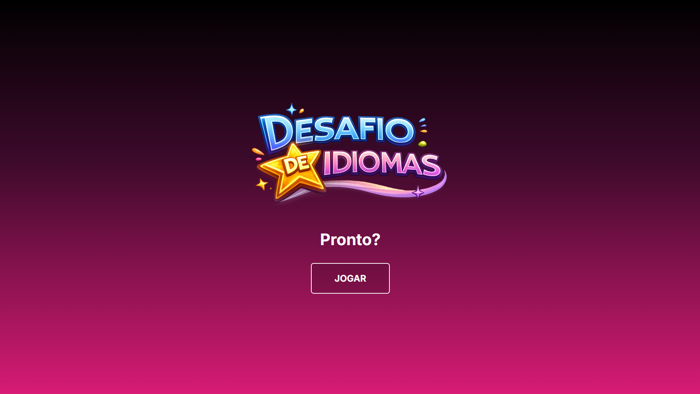

# 🌍 Desafio de Idiomas

Mini game de quiz onde o jogador adivinha:
- qual é o idioma
- qual é a tradução

Cada erro no idioma perde uma vida.
Ganha 10 pontos por acerto.
Timer de 10 segundos por pergunta.

## 🎮 Como jogar
Clique em **JOGAR** e escolha a resposta correta antes do tempo acabar. Dentro quiz, caso queira começar novamente, clique no logo. Ao fim do jogo, clique em **JOGAR NOVAMENTE** para voltar para o quiz.

## 🛠 Tecnologias
- HTML
- CSS
- JavaScript 

## ▶️ Demo
https://mfariav.github.io/descubra-o-idioma/
